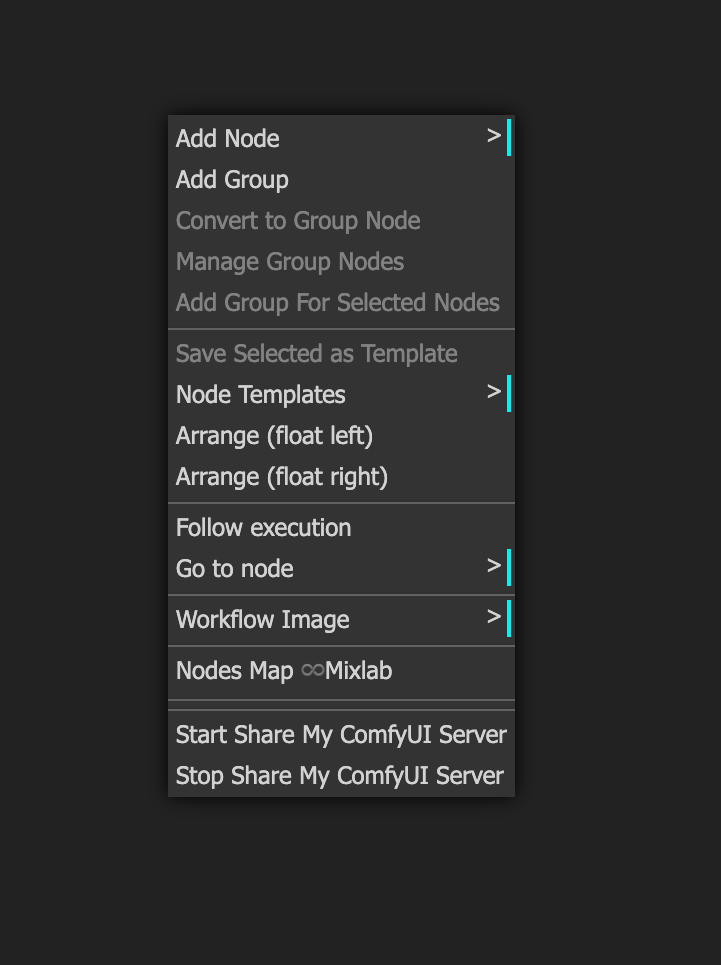
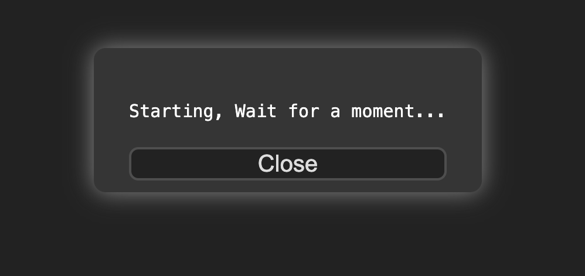
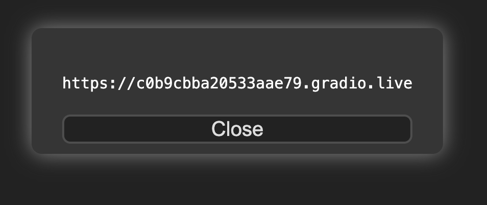

# ComfyUI_ShareServer
- Share your local ComfyUI with a public link

# How To Use
1. Install ComfyUI_ShareServer in the custom_nodes folder of your ComfyUI.
2. Restart your ComfyUI.
3. Right-click.
4. Select "Start Share My ComfyUI Server".
5. Copy the share link if successful.
6. Now, you can use this link to access your local ComfyUI from any browser, anywhere.
7. The link is valid for 72 hours. Each time you click "Start Share My ComfyUI Server", a new link is generated and the old one becomes invalid.
8. To stop sharing, select "Stop Share My ComfyUI Server".

# Config Proxy

if got the tip: Failed, timeout! Make sure your env can access "https://api.gradio.app/"

you can config the proxy in the file of `proxy_config.json`


```
{
    "proxy":"http://127.0.0.1:7890",
    "proxy_demo":"http://127.0.0.1:7890"
}
```

# Suport
1. win
2. mac
3. linux

 
 
 


